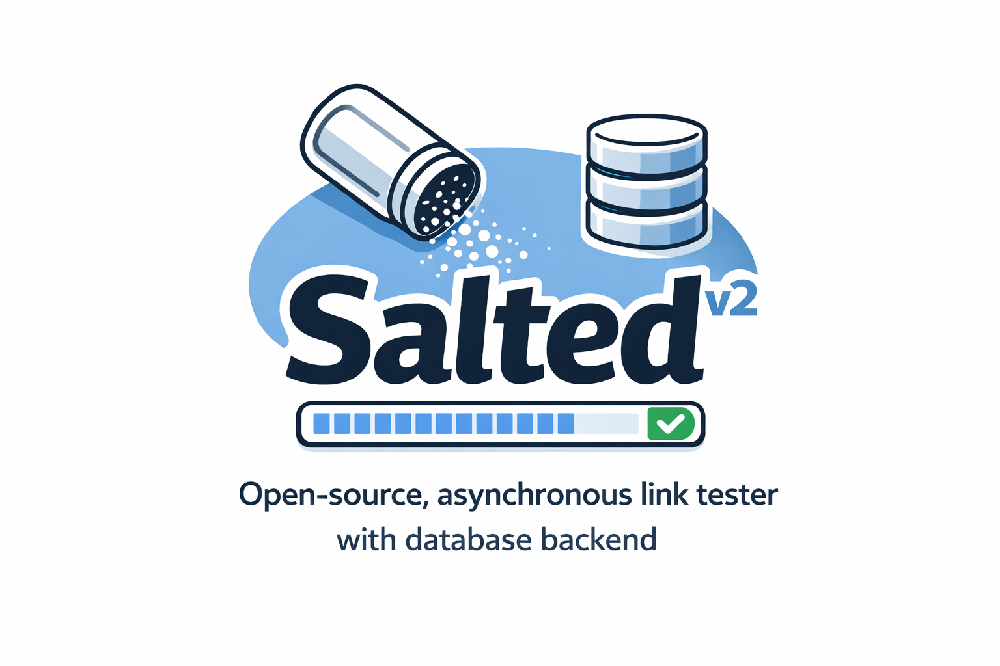

# SALTED — Python Link Checker for HTML, Markdown & TeX


[](https://pepy.tech/project/salted)
[](https://www.ruediger-voigt.eu/coverage/salted/index.html)

<p align="center">
  
</p>

SALTED is a fast, async Python link checker for HTML, Markdown, TeX, and BibTeX files. It detects broken hyperlinks, uses a local cache to avoid rechecking. It is a command line application and integrates into CI/CD pipelines. It can be run on Windows, Linux and Mac.

It was developed to check hyperlinks in scientific works (Markdown, TeX) as broken links are seen as sloppy. It can also scan HTML files because dead hyperlinks are bad for user experience and will hurt SEO. It is designed to be run automatically (for example in a quality control pipelines). Speed is an explicit design goal. SALTED is short for "Smart, Asynchronous Link Tester with Database backend".

Key advantages of this application:
* *It is smart.*
    * Salted uses a configurable cache. If your check found some broken links and you fixed them within the cache lifetime (default: 24h), then the next run will only check the changed links.
    * It normalizes URLs. Because `https://www.example.com/index.html#one` and `https://www.example.com/index.html#two` point to the same page, only one check is performed.
* *It is fast.*
    * Some linkcheckers work in a linear way - one link after another. Salted spawns many asynchronous worker threads that work in parallel and free up resources while waiting on a server's response.
    * Salted is very fast and can check dozens of links *per second* (depending on your connection).
* *Salted can be used stand-alone or in a CI pipeline / within GitHub actions.*
     * The result can be written to standard out / the command line or to a file.
     * It can raise an exception in case it found broken links.
     * You can use salted as a library or as a command line script.
* *Results can be styled using Jinja2 templates.*
     * Two default templates (for the command line and for Markdown) are available.
     * You can use your own templates. 

## Example

All files you want to check have to be in one directory. Subdirectories will be crawled. Assuming the files you want to check are located in the "homepage" folder.

Open the command line:
```
cd /folder_above_homepage
salted -i ./homepage/
```
*Alternatively* open a Python shell:
```python
import logging
import salted
logging.basicConfig(level=logging.INFO)

linkcheck = salted.Salted()
linkcheck.check('./homepage/')
```
Two runs in a row (i.e. one full check and one using the cache):


Salted automatically recognizes supported file formats by their extension (i.e. `htm`, `html`, `md`, `tex`, and `bib`).

## Installation

Installation is straightforward using pip:

```bash
pip install salted
```

*The installation via pip / pip3 install the library salted AND registers it as a command line script in the path. So you can just call salted in the terminal.*

## Supported File Formats

SALTED does support the following file-formats:

* **HTML** :
  * Standard hyperlinks / anchors are checked.
  * Internal links (relative paths like `../about/index.html`, root-relative paths like `/contact.html`, and fragments like `#section` or `page.html#intro`) are resolved on disk and verified to exist. Fragments must match an `id` (or `<a name>`) in the target HTML file. Disable with `--no-check_internal_links`. For security, targets resolving outside the checked folder are never probed — they are listed as "not checked".
  * Salted does not yet check `src` attributes of pictures.
  * Mailto links are parsed and listed in the report with basic format validation (no DNS lookup or delivery check).
* **Markdown** : The pandoc version as well as GitHub flavored markdown are supported.
* **TeX** : salted recognizes `\url{url}` as well as `\href{url}{text}`, but the hyperref option `baseurl` is ignored.
* **BibTeX** : URL and DOI fields are extracted and checked. BibTeX files are included when using `--file_types tex` or `--file_types supported`.
* **Microsoft Word**: is not directly supported, but you can convert Word to markdown which is supported.


## Further Documentation


* [Running salted from the command line](documentation/running-salted-from-the-cli.md)
* [Using salted as a Python library](documentation/using-salted-as-a-python-library.md)
* [Use a config file](documentation/use-a-config-file.md)
* [Style the output and write to files](documentation/style-salted-output.md)
* [Handling problematic servers](documentation/handling-problematic-servers.md)
* [Dependencies and Security](documentation/dependencies-and-security.md)
* [Changelog](CHANGELOG.md)
