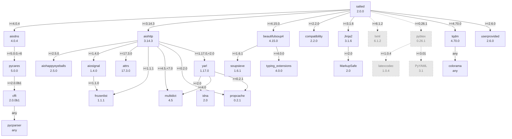

<!-- Generated by scripts/generate_dependency_graph.py - do not edit by hand. The prose belongs in dependency-graph.md. -->

```mermaid
flowchart TD
    classDef missing stroke-dasharray: 5
    classDef optional fill:#e8e8e8,stroke:#aaaaaa,color:#777777,stroke-dasharray:4
    aiodns["aiodns<br/>4.0.4"]
    aiohappyeyeballs["aiohappyeyeballs<br/>2.5.0"]
    aiohttp["aiohttp<br/>3.14.3"]
    aiosignal["aiosignal<br/>1.4.0"]
    attrs["attrs<br/>17.3.0"]
    beautifulsoup4["beautifulsoup4<br/>4.15.0"]
    cffi["cffi<br/>2.0.0b1"]
    colorama["colorama<br/>any"]
    compatibility["compatibility<br/>2.2.0"]
    frozenlist["frozenlist<br/>1.1.1"]
    idna["idna<br/>2.0"]
    jinja2["Jinja2<br/>3.1.6"]
    latexcodec["latexcodec<br/>1.0.4"]:::optional
    lxml["lxml<br/>6.1.2"]:::optional
    markupsafe["MarkupSafe<br/>2.0"]
    multidict["multidict<br/>4.5"]
    propcache["propcache<br/>0.2.1"]
    pybtex["pybtex<br/>0.26.1"]:::optional
    pycares["pycares<br/>5.0.0"]
    pycparser["pycparser<br/>any"]
    pyyaml["PyYAML<br/>3.1"]:::optional
    salted["salted<br/>2.0.0"]
    soupsieve["soupsieve<br/>1.6.1"]
    tqdm["tqdm<br/>4.70.0"]
    typing-extensions["typing_extensions<br/>4.0.0"]
    userprovided["userprovided<br/>2.6.0"]
    yarl["yarl<br/>1.17.0"]
    aiodns -- ">=5.0.0,<6" --> pycares
    aiohttp -- ">=2.5.0" --> aiohappyeyeballs
    aiohttp -- ">=1.4.0" --> aiosignal
    aiohttp -- ">=17.3.0" --> attrs
    aiohttp -- ">=1.1.1" --> frozenlist
    aiohttp -- ">=4.5,<7.0" --> multidict
    aiohttp -- ">=0.2.0" --> propcache
    aiohttp -- ">=1.17.0,<2.0" --> yarl
    aiosignal -- ">=1.1.0" --> frozenlist
    beautifulsoup4 -- ">=1.6.1" --> soupsieve
    beautifulsoup4 -- ">=4.0.0" --> typing-extensions
    cffi -- "any" --> pycparser
    jinja2 -- ">=2.0" --> markupsafe
    pybtex -. ">=1.0.4" .-> latexcodec
    pybtex -. ">=3.01" .-> pyyaml
    pycares -- ">=2.0.0b1" --> cffi
    salted -- ">=4.0.4" --> aiodns
    salted -- ">=3.14.3" --> aiohttp
    salted -- ">=4.15.0" --> beautifulsoup4
    salted -- ">=2.2.0" --> compatibility
    salted -- ">=3.1.6" --> jinja2
    salted -. ">=6.1.2" .-> lxml
    salted -. ">=0.26.1" .-> pybtex
    salted -- ">=4.70.0" --> tqdm
    salted -- ">=2.6.0" --> userprovided
    tqdm -- "any" --> colorama
    yarl -- ">=2.0" --> idna
    yarl -- ">=4.0" --> multidict
    yarl -- ">=0.2.1" --> propcache
```
