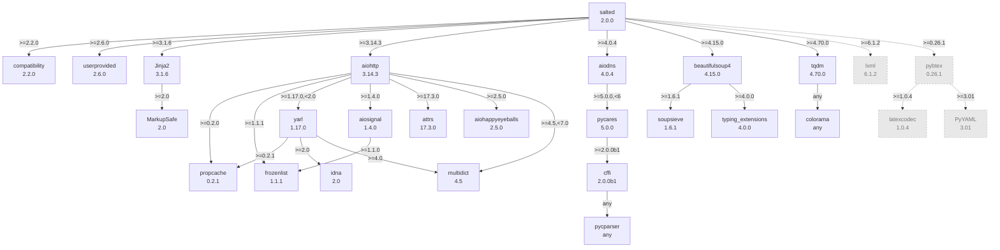

Versions shown are the **minimum** each constraint allows, not the versions that
happen to be installed anywhere. For salted's own dependencies they are the floors
declared in `pyproject.toml`; for everything below them they are derived from the
constraint on the edge that pulls them in. Installing today resolves to newer
versions than these — this graph answers "what is the oldest set salted claims to
work with", which is what a lower-bound bump has to be checked against.

Solid arrows are installed by `pip install salted`. Dotted arrows and greyed nodes
are optional extras: `salted[lxml]`, `salted[bibtex]`, or `salted[all]` for both.
Note that `latexcodec` and `PyYAML` reach a default install through nothing else —
they arrive only with `pybtex`.

Where two parents constrain the same package, the higher floor wins: `propcache` is
`>=0.2.1` (yarl) rather than `>=0.2.0` (aiohttp), and `frozenlist` is `>=1.1.1`
(aiohttp) rather than `>=1.1.0` (aiosignal). `colorama` and `pycparser` are pulled in
without a lower bound at all.
